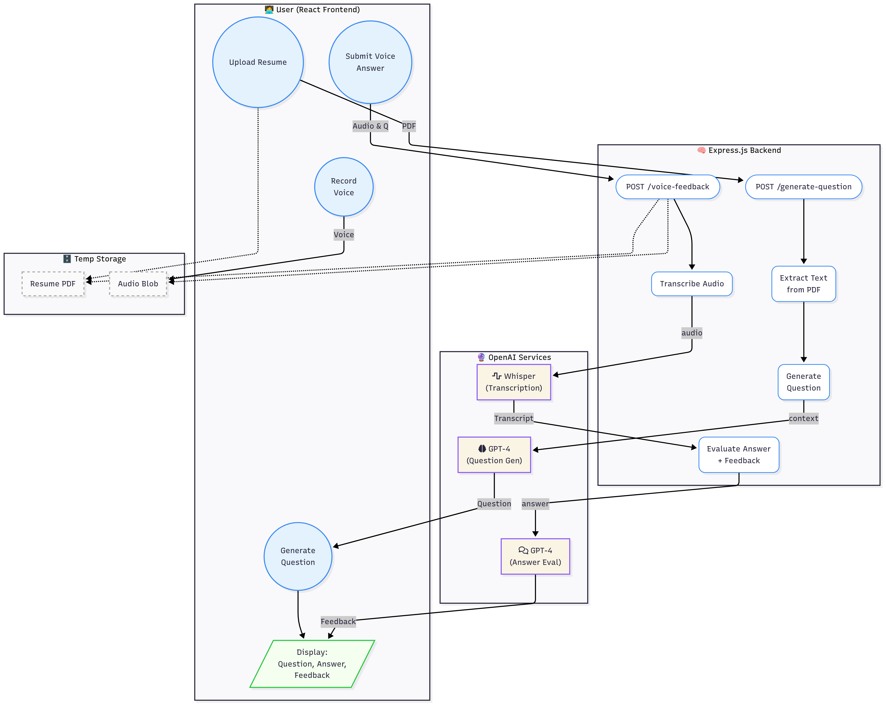
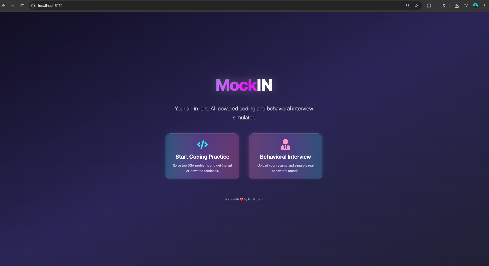
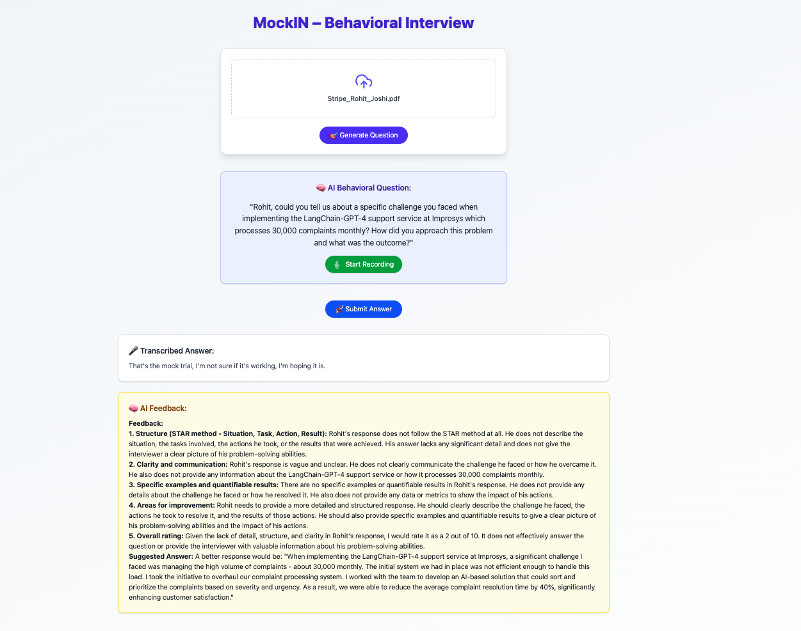
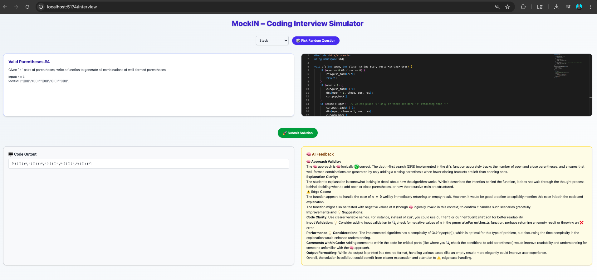

# MockIN – AI-Powered Mock Interview Platform 🎙️💻

MockIN is an all-in-one AI-powered coding and behavioral interview simulator designed to help students prepare for real-world technical and HR interviews using cutting-edge LLM technology.

---

## 🧠 Key Features

- 🎯 **Behavioral Interview Simulation**: Upload your resume → get AI-generated behavioral questions → record your response → receive real-time AI feedback.
- 💡 **Coding Interview Practice**: Solve popular DSA problems → submit your code → receive GPT-4 based code feedback.
- 🔊 **Voice Input Support**: Speak your answers, powered by OpenAI Whisper for transcription.
- 🧾 **Resume-Aware Question Generation**: Behavioral questions are dynamically tailored to your resume.
- ⚙️ **Tech Stack**: 
  - Frontend: React + Tailwind CSS + Vite
  - Backend: Express.js + Node.js
  - AI: OpenAI GPT-4 + Whisper APIs
  - Code Execution: Judge0 (via RapidAPI)

---

## 📦 Installation

1. **Clone the repository:**
   ```bash
   git clone <your-repo-url>
   cd MockIN
   ```

2. **Install server dependencies:**
   ```bash
   cd server
   npm install
   ```

3. **Install client dependencies:**
   ```bash
   cd ../client
   npm install
   ```

4. **Set up environment variables:**
   ```bash
   cp server/.env.example server/.env
   cp client/.env.example client/.env
   # Then, fill in your OpenAI and Judge0 keys
   ```

---

## 🚀 Running the Application

1. **Start the server:**
   ```bash
   cd server
   npm run dev
   ```

2. **Start the client:**
   ```bash
   cd client
   npm run dev
   ```

---

## 📁 Project Structure

```
MockIN/
├── client/          # React frontend (Vite)
├── server/          # Express backend (Node.js)
├── assets/          # Screenshots and diagrams
└── README.md        # This file
```

---

## 🧱 System Architecture



---

## 🖼️ Screenshots

### Landing Page


### Behavioral Interview – Transcribed Answer + Feedback


### Coding Interview Simulator


---

## 📡 API Routes (Backend)

- `POST /api/generate-question`: Generates behavioral question from uploaded resume
- `POST /api/voice-feedback`: Submits audio → transcribes via Whisper → evaluated via GPT-4
- `POST /api/evaluate`: Submits code and receives feedback

---

## ✨ Future Improvements

- Add user accounts and history tracking
- Multiple question rounds (coding + behavioral)
- Real-time LLM-based mock interviewer interface

---

## 👨‍💻 Author

Made with ❤️ by Rohit Joshi  
MSCS @ USC | AI & Full Stack Developer | Summer 2026 SWE Internships Focus

---